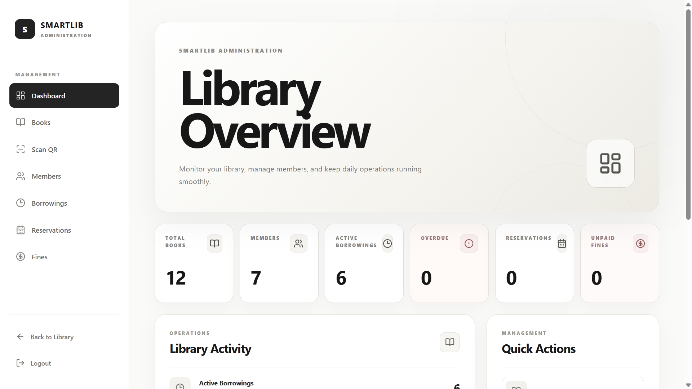
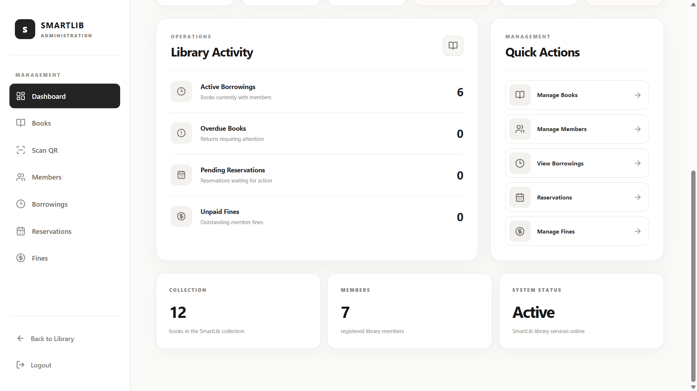
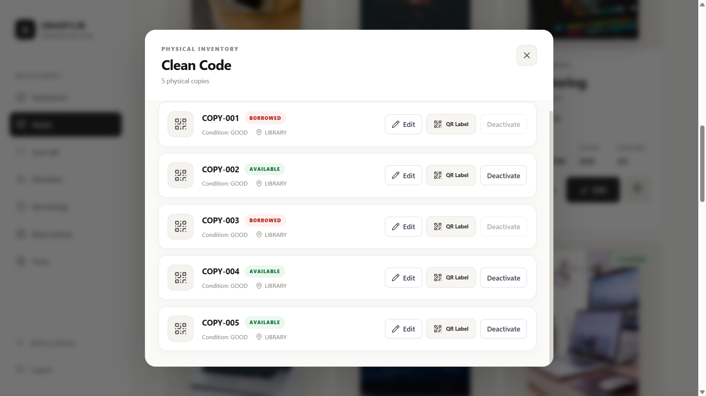
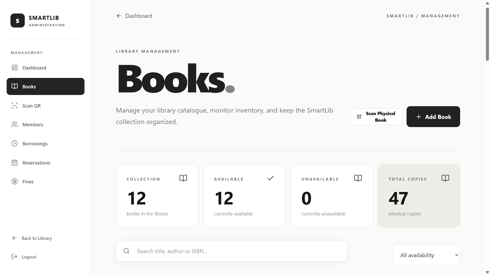
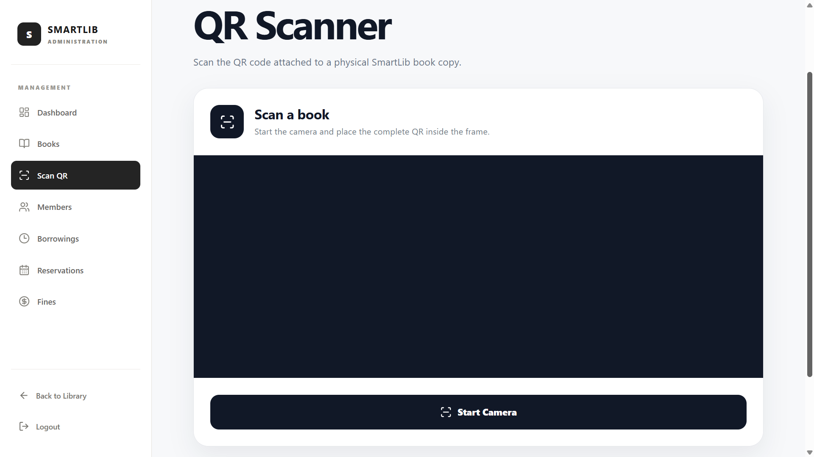
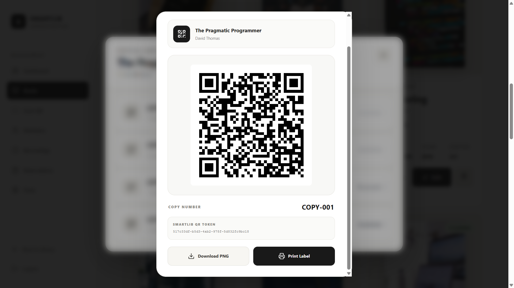
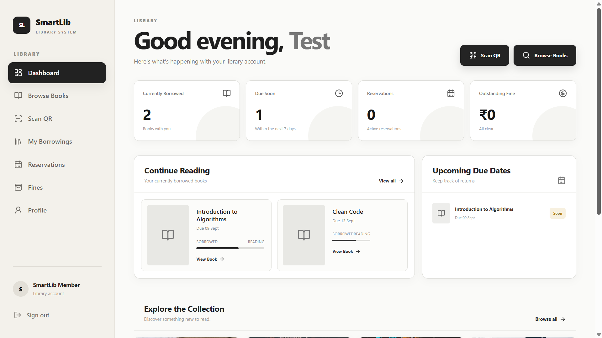
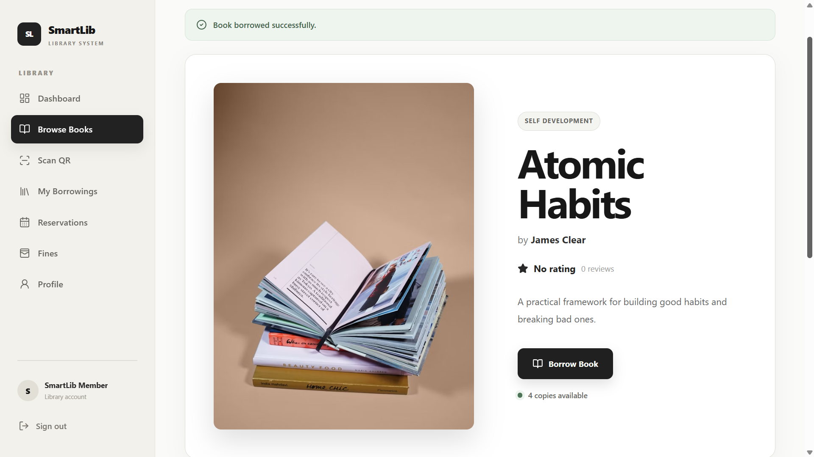
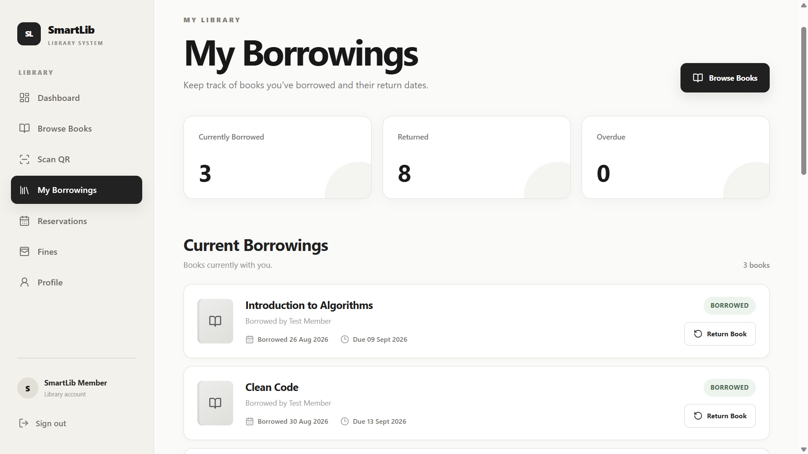
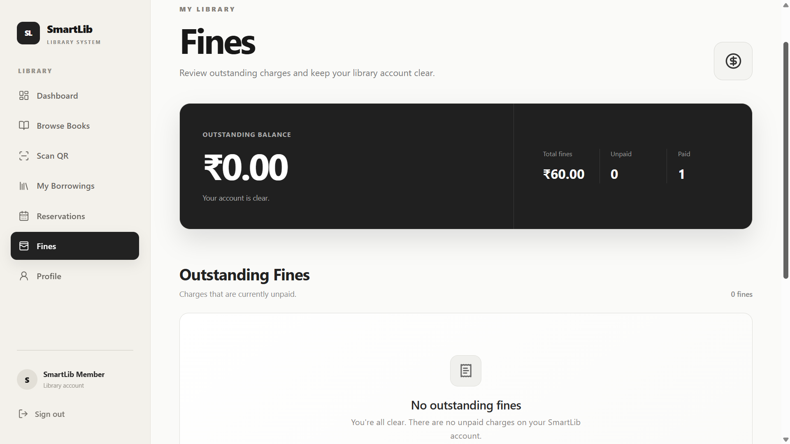

# SmartLib — Modern Library Management System

<p align="center">
  <strong>A full-stack library management platform with QR-powered physical book circulation.</strong>
</p>

<p align="center">
  <a href="https://smartlib-frontend-nmml.onrender.com">Live Demo</a>
  &nbsp;•&nbsp;
  <a href="https://github.com/MSANTHOSH147/smartlib">GitHub Repository</a>
</p>

<p align="center">
  
  
  
  
  
  
</p>

<p align="center">
  
  
  
  
</p>

---

## 📖 Overview

**SmartLib** is a modern full-stack Library Management System built to digitize library operations from catalogue management to physical book circulation.

Unlike a basic CRUD-based library application, SmartLib models **individual physical book copies** as separate inventory entities.

A single book title can therefore have multiple physical copies, each with its own identity, QR code, status, condition, location, and circulation history.

```text
Book
│
├── COPY-001
├── COPY-002
├── COPY-003
└── COPY-004
```

This makes SmartLib capable of representing the actual physical movement of books inside a library.

The platform provides separate workflows for **administrators/librarians** and **members**, covering catalogue management, physical inventory, QR-based circulation, borrowing, returns, reservations, overdue tracking, and fines.

---

## 🌐 Live Application

**Frontend:**  
https://smartlib-frontend-nmml.onrender.com

**Backend:**  
https://smartlib-backend-62iz.onrender.com

**Database:**  
Aiven MySQL

**Hosting:**  
Render

---

# 🤖 SmartLib AI — Retrieval-Augmented Library Intelligence

SmartLib AI is not a generic conversational chatbot wrapper. It is a multi-model, retrieval-augmented intelligence system engineered to bridge physical library operations, semantic vector discovery, transactional database state, and open AI protocols.

### 🏛️ SmartLib AI Architecture

```text
                               SMARTLIB AI ASSISTANT
                                         │
                                ┌────────▼────────┐
                                │ AI ORCHESTRATOR │
                                └────────┬────────┘
                                         │
                     ┌───────────────────┼───────────────────┐
                     │                   │                   │
                     ▼                   ▼                   ▼
               SmartLib Tools      Web Grounding            MCP
                     │             (Google Search)      (MCP Server)
                     ▼                                       │
            Hybrid Retrieval                                 ▼
                     │                                Read-Only Gateway
             ┌───────┴───────┐                        (Tools & Prompts)
             ▼               ▼
        MySQL Lexical   Qdrant Vectors
        (Authoritative) (gemini-embedding-2 / 768d)
             │               │
             └───────┬───────┘
                     ▼
          Reciprocal Rank Fusion (RRF, k=60)
                     │
                     ▼
          Top 20 Candidate Books
                     │
                     ▼
          DeterministicBookReranker
          (5-Signal Normalized Scoring)
                     │
                     ▼
          Top 5 Hydrated Final Books
                     │
         ┌───────────┴───────────┐
         ▼                       ▼
   Primary: Gemini 3.8 Flash   Fallback: Groq (Llama 3.3 70B)
   (Function Calling)          (Automatic Circuit Breaker)
         │                       │
         └───────────┬───────────┘
                     ▼
           Answer + Sources (Attributed)
                     │
                     ▼
        Observability & Telemetry
        (AiRequestTrace + Micrometer Metrics)
```

### 🚀 Key AI Capabilities
1. **Multi-Model Routing & High Availability**: Primary reasoning powered by **Google Gemini 3.8 Flash** with automatic circuit breaker failover to **Groq Cloud (Llama 3.3 70B Versatile)** during rate limits or outages.
2. **Hybrid RRF Search**: Merges relational SQL full-text matching with **Qdrant** vector similarity over 768-dimensional `gemini-embedding-2` representations using Reciprocal Rank Fusion ($k=60$).
3. **Deterministic Reranker**: Post-retrieval reranking pipeline scoring semantic similarity, lexical rank, exact title match, author match, and category alignment to surface the optimal Top 5 books.
4. **Authoritative Inventory Grounding**: The LLM is never an authorization boundary. Physical copy availability, shelf locations, and user loans are hydrated directly from MySQL transactions.
5. **Personalized Recommendations**: Combines previous borrowing history, memory preferences, and catalog ratings to recommend relevant titles.
6. **User Memory with Privacy Controls**: Inert user preference storage (`<USER_MEMORY>`) allowing users to inspect and forget saved preferences on demand.
7. **Real-Time Web Grounding**: Google Search grounding dynamically retrieves contemporary facts and publishing news with verified source citations.
8. **Model Context Protocol (MCP)**: Implements an MCP stdio server allowing external AI agents (e.g. Claude Desktop) to discover catalog tools and resources.
9. **Factual AI Evaluation**: Versioned benchmark framework (`smartlib-ai-evaluation.json`) measuring tool selection accuracy, security bounds, and retrieval recall.
10. **Privacy-Preserving Observability**: Structured request tracing (`AiRequestTrace`), UUID request correlation (`X-AI-Request-Id`), and Micrometer metrics without logging prompts or user data.

---

# ✨ Core Application Features

## 🔐 Authentication & Authorization

- JWT-based authentication
- Role-based access control
- Admin and member workflows
- Protected REST API endpoints
- Token-based frontend API requests
- Production CORS configuration

---

## 📚 Book Management

Administrators can manage the library catalogue through:

- Add books
- Edit books
- Delete books
- View book details
- Track available copies
- Manage physical copies
- View inventory information

---

## 🏷️ Physical Book-Copy Management

SmartLib separates a **book title** from its physical copies.

For example:

```text
The Lean Startup
│
├── COPY-001
├── COPY-002
├── COPY-003
└── COPY-004
```

Every physical copy can maintain its own:

### Status

```text
AVAILABLE
BORROWED
RESERVED
DAMAGED
LOST
MAINTENANCE
```

### Condition

```text
NEW
GOOD
FAIR
DAMAGED
LOST
```

### Additional information

- Copy number
- QR token
- Location
- Created date
- Updated date
- Borrowing state
- Reservation state

This provides a realistic physical inventory model instead of treating every book title as a single item.

---

# 📱 QR-Powered Book Circulation

Each physical book copy can have a unique QR code associated with its inventory record.

### QR Workflow

```text
Physical Book
      ↓
Book Copy
      ↓
Unique QR Code
      ↓
Scan QR
      ↓
Identify Physical Copy
      ↓
Borrow / Return
      ↓
Update Inventory Status
```

### QR capabilities

- Generate QR codes
- Display QR codes
- Print QR codes
- Download QR codes
- Scan QR codes
- Identify exact physical copies
- Borrow through QR workflow
- Return through QR workflow
- Update physical copy status

---

# 🔄 Borrowing & Return Workflow

Borrowing is associated with the **physical book copy**, not only the book title.

```text
┌─────────────┐
│  AVAILABLE  │
└──────┬──────┘
       │
     BORROW
       │
       ▼
┌─────────────┐
│   BORROWED  │
└──────┬──────┘
       │
     RETURN
       │
       ▼
┌─────────────┐
│  AVAILABLE  │
└─────────────┘
```

When a reservation is waiting:

```text
BORROWED
   ↓
RETURN
   ↓
RESERVED
   ↓
Reservation Fulfilled
```

This allows SmartLib to maintain a clear circulation lifecycle for individual physical copies.

---

# 📅 Reservations

Members can reserve books when copies are unavailable.

Reservation-aware circulation allows returned copies to be associated with pending reservations.

Typical workflow:

```text
Book Unavailable
       ↓
Member Creates Reservation
       ↓
Copy Is Returned
       ↓
Pending Reservation Detected
       ↓
Copy Becomes Reserved
       ↓
Reservation Fulfilled
```

---

# ⏰ Overdue & Fine Management

SmartLib provides overdue and fine tracking for borrowed books.

The system supports:

- Borrow dates
- Due dates
- Overdue detection
- Fine calculation
- Fine visibility
- Member fine tracking
- Administrative fine management

Members can view their borrowing and fine information through their dashboard.

---

# 👨‍💼 Admin Dashboard

The administrator experience provides operational visibility into the library.

### Admin capabilities

- Dashboard overview
- Library activity
- Book management
- Physical inventory
- Book-copy management
- QR management
- Borrowing records
- Reservations
- Fine management
- Member activity

---

# 👤 Member Dashboard

Members have access to their own library activity.

### Member capabilities

- Browse books
- View book availability
- Borrow books
- Return books
- Scan QR codes
- View current borrowings
- View borrowing history
- Track reservations
- View fines

---

# 🖥️ Application Screenshots

## 01 — Admin Dashboard



---

## 02 — Library Activity



---

## 03 — Physical Inventory



---

## 04 — Books



---

## 05 — Scan QR



---

## 06 — QR Print / Download



---

## 07 — Member Dashboard



---

## 08 — Browse Books



---

## 09 — My Borrowings



---

## 10 — Fines



---

# 🏗️ System Architecture

```text
                         SMARTLIB
                            │
             ┌──────────────┴──────────────┐
             │                             │
             ▼                             ▼
      React Frontend                Spring Boot Backend
          + Vite                    + Spring Security
             │                             │
             │         REST API            │
             └──────────────┬──────────────┘
                            │
                            ▼
                     JPA / Hibernate
                            │
                            ▼
                       MySQL 8.4
                            │
                            ▼
                       Aiven Cloud
```

---

# ☁️ Production Infrastructure

```text
                           GitHub
                             │
              ┌──────────────┴──────────────┐
              │                             │
              ▼                             ▼
       React Frontend                Spring Boot Backend
              │                             │
              ▼                             ▼
       Render Static Site                  Docker
                                            │
                                            ▼
                                          Render
                                            │
                                            ▼
                                       Aiven MySQL
```

---

# 🧩 Technology Stack

## Frontend

| Technology | Purpose |
|---|---|
| React 19 | User interface |
| Vite | Development and production build tooling |
| JavaScript | Application logic |
| React Router | Client-side navigation |
| Axios | REST API communication |
| Lucide React | UI icons |
| html5-qrcode | QR scanning |
| qrcode | QR generation |

## Backend

| Technology | Purpose |
|---|---|
| Java 21 | Backend language |
| Spring Boot 4.1 | Application framework |
| Spring Web | REST API development |
| Spring Data JPA | Persistence layer |
| Hibernate | ORM |
| Spring Security | Authentication and authorization |
| JWT | Stateless authentication |
| Spring Mail | Email functionality |
| Maven | Build and dependency management |

## Database & Infrastructure

| Technology | Purpose |
|---|---|
| MySQL 8.4 | Relational database |
| Aiven | Managed cloud MySQL |
| Docker | Backend containerization |
| Render | Cloud deployment |
| GitHub | Source control |

---

# 🗃️ Core Domain Model

SmartLib is structured around several core entities.

```text
User
 │
 ├── Role
 ├── Borrowings
 ├── Reservations
 └── Fines


Book
 │
 ├── Book Copies
 └── Reservations


Book Copy
 │
 ├── Book
 ├── QR Token
 ├── Status
 ├── Condition
 └── Location


Borrowing
 │
 ├── User
 ├── Book
 ├── Book Copy
 ├── Borrow Date
 └── Due Date


Reservation
 │
 ├── User
 ├── Book
 └── Status
```

---

# 🔒 Security

SmartLib uses JWT-based authentication with role-aware access control.

### Security considerations

- Stateless JWT authentication
- Protected backend endpoints
- Role-based authorization
- Production CORS configuration
- Environment-based secrets
- Externalized database credentials
- Externalized email credentials
- Sensitive environment files excluded from Git
- No production credentials committed to source control

---

# ⚙️ Local Development

## Prerequisites

Install the following:

- Java 21+
- Node.js 18+
- npm
- MySQL 8+
- Git
- Docker (optional)

---

## 1. Clone the Repository

```bash
git clone https://github.com/MSANTHOSH147/smartlib.git
cd smartlib
```

---

# 🚀 Backend Setup

Navigate to the backend:

```bash
cd backend
```

Configure the required environment variables.

Example:

```env
DB_URL=jdbc:mysql://localhost:3306/smartlib?useSSL=false&serverTimezone=UTC&allowPublicKeyRetrieval=true
DB_USERNAME=root
DB_PASSWORD=your_password

JWT_SECRET=your_strong_jwt_secret

MAIL_HOST=smtp.gmail.com
MAIL_PORT=587
MAIL_USERNAME=your_email
MAIL_PASSWORD=your_app_password
```

### Windows

```powershell
.\mvnw spring-boot:run
```

### Linux / macOS

```bash
./mvnw spring-boot:run
```

Backend:

```text
http://localhost:8080
```

---

# 🎨 Frontend Setup

Open another terminal:

```bash
cd frontend
```

Install dependencies:

```bash
npm install
```

Create:

```text
.env.local
```

Add:

```env
VITE_API_URL=http://localhost:8080/api
```

Start the frontend:

```bash
npm run dev
```

Frontend:

```text
http://localhost:5173
```

---

# 🐳 Docker

The backend includes a production-oriented Dockerfile.

### Build

```bash
docker build -t smartlib-backend ./backend
```

### Run

```bash
docker run -p 10000:10000 smartlib-backend
```

---

# 🌍 Production Deployment

SmartLib is deployed using separate frontend, backend and database infrastructure.

### Frontend

```text
React + Vite
      ↓
Render Static Site
```

### Backend

```text
Spring Boot
      ↓
Docker
      ↓
Render Web Service
```

### Database

```text
MySQL 8.4
      ↓
Aiven Cloud
```

Production configuration is supplied through environment variables.

---

# 🧪 Production Validation

The deployed application has been validated across the major workflows.

### Authentication

- Admin login
- Member login
- JWT authentication
- Protected routes

### Administration

- Dashboard
- Library activity
- Books
- Physical inventory
- Book copies
- QR management

### Member

- Browse books
- Borrowing
- Returns
- QR scanning
- Reservations
- Borrowing history
- Fines

### Infrastructure

- Frontend deployment
- Backend deployment
- Cloud database connectivity
- Production CORS
- API communication
- SPA routing

---

# 📁 Project Structure

```text
smartlib/
│
├── backend/
│   ├── src/
│   │   └── main/
│   │       ├── java/
│   │       └── resources/
│   │
│   ├── pom.xml
│   ├── Dockerfile
│   └── mvnw
│
├── frontend/
│   ├── src/
│   │   ├── components/
│   │   ├── pages/
│   │   ├── services/
│   │   └── ...
│   │
│   ├── package.json
│   └── vite.config.js
│
├── screenshots/
│   ├── 01-admin-dashboard.png
│   ├── 02-library-activity.png
│   ├── 03-physical-inventory.png
│   ├── 04-books.png
│   ├── 05-scan-qr.png
│   ├── 06-qr-print-download.png
│   ├── 07-member-dashboard.png
│   ├── 08-browse-books.png
│   ├── 09-my-borrowings.png
│   └── 10-fines.png
│
├── .gitignore
└── README.md
```

---

# 💡 Engineering Highlights

## Physical-copy-first inventory

Instead of modelling:

```text
1 Book = 1 Physical Item
```

SmartLib models:

```text
Book
 ├── Copy 001
 ├── Copy 002
 ├── Copy 003
 └── Copy 004
```

Every copy can have its own lifecycle.

---

## QR-linked physical inventory

QR codes are associated with individual physical book copies.

A scan can resolve to:

```text
QR Code
   ↓
Book Copy
   ↓
Book
   ↓
Current Status
   ↓
Circulation Action
```

---

## Copy-aware borrowing

Borrowing transactions reference the physical book copy involved in the transaction.

This provides better traceability for:

- Which copy was borrowed
- Which copy was returned
- Current copy status
- Physical condition
- Circulation history

---

## Environment-based configuration

Database credentials, JWT secrets, email credentials and other production configuration are supplied through environment variables.

Sensitive configuration is intentionally excluded from source control.

---

## Production-oriented architecture

SmartLib was designed to run beyond localhost using:

- Docker
- Render
- Aiven MySQL
- Environment variables
- Production CORS
- SPA routing
- REST APIs

---

# 🛣️ Roadmap

SmartLib V2 is focused on intelligence, automation and analytics.

- [ ] Advanced library analytics
- [ ] Advanced search and filtering
- [ ] Improved notification system
- [ ] Reading activity insights
- [ ] Personalized recommendations
- [ ] Intelligent library assistant
- [ ] AI-powered book recommendations
- [ ] Natural-language search
- [ ] AI-assisted book discovery
- [ ] Smart circulation analytics
- [ ] Advanced operational reporting

---

# 🤖 SmartLib V2 — AI Direction

The next phase of SmartLib is focused on introducing intelligent capabilities into the library experience.

Potential capabilities include:

```text
                         Member
                            │
                            ▼
                   ┌─────────────────┐
                   │ AI Library      │
                   │ Assistant       │
                   └────────┬────────┘
                            │
              ┌─────────────┼─────────────┐
              ▼             ▼             ▼
           Search       Recommend     Analytics
              │             │             │
              ▼             ▼             ▼
           Books          Books        Insights
```

Potential AI capabilities:

- Natural-language book search
- Personalized recommendations
- Book discovery
- Availability questions
- Alternative book suggestions
- Reading-pattern insights
- AI-powered library assistance

The long-term goal is to evolve SmartLib from a traditional management system into an **intelligent library platform**.

---

# 🎯 Project Goals

SmartLib focuses on three core ideas.

### Simplify

Reduce repetitive manual library operations through digital workflows.

### Track

Maintain accurate information about books, physical copies, borrowing, reservations and fines.

### Automate

Use QR-powered workflows and future intelligent capabilities to reduce manual effort.

---

# 📌 Current Status

## SmartLib v1.0.0 — Production MVP

The current release includes the core:

- Authentication
- Book management
- Physical inventory
- Book-copy management
- QR generation
- QR scanning
- Borrowing
- Returns
- Reservations
- Overdue tracking
- Fine management
- Admin operations
- Member operations

The application is deployed and available through the production environment.

---

# 📈 What I Learned

Building SmartLib involved more than connecting a frontend to a backend.

The project provided practical experience with:

- Full-stack application architecture
- REST API design
- JWT authentication
- Role-based authorization
- Relational database modelling
- JPA and Hibernate
- Physical inventory modelling
- QR-based workflows
- React application architecture
- Docker
- Cloud deployment
- Environment-based configuration
- Production debugging
- CORS configuration
- SPA routing

One of the key lessons from the project was that real-world software often needs to model the **physical world**, not just the data representing it.

---

# 🚀 Future Vision

The long-term direction of SmartLib is:

```text
Management
     ↓
Automation
     ↓
Analytics
     ↓
Intelligence
     ↓
AI-Powered Library
```

The goal is to build a library platform that not only records transactions, but also helps users and administrators make better decisions.

---

# 👨‍💻 Author

SmartLib was built as a full-stack engineering project with a focus on:

- Practical system design
- Real-world domain modelling
- Physical inventory management
- QR-based circulation
- Secure authentication
- Cloud deployment
- Future AI integration

---

# ⭐ Support

If you find SmartLib interesting, consider giving the repository a ⭐ on GitHub.

**Live Demo:**  
https://smartlib-frontend-nmml.onrender.com

**GitHub:**  
https://github.com/MSANTHOSH147/smartlib

---

<p align="center">
  <strong>SmartLib — Turning library operations into a smarter digital workflow.</strong>
</p>

<p align="center">
  Java • Spring Boot • React • MySQL • JWT • QR • Docker • Cloud
</p>